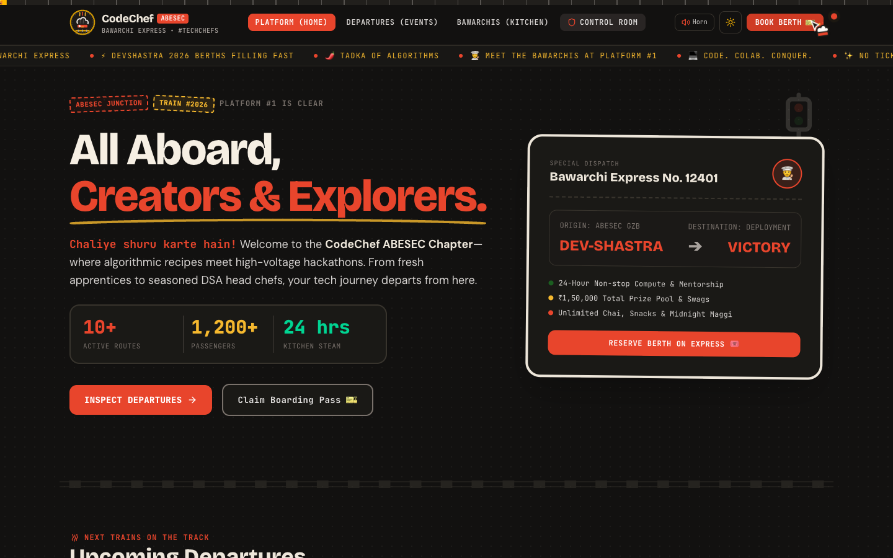
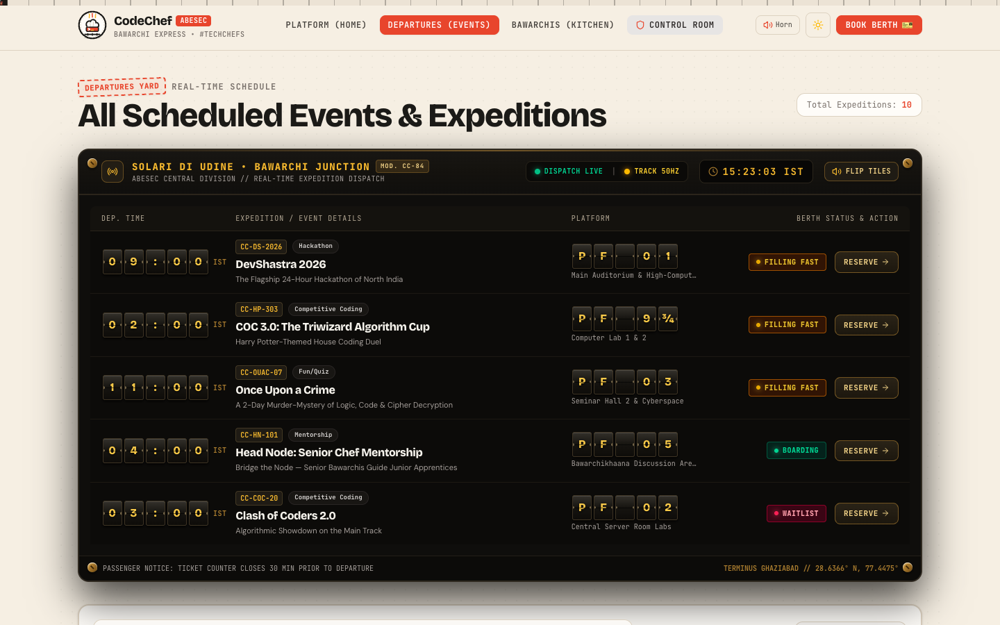
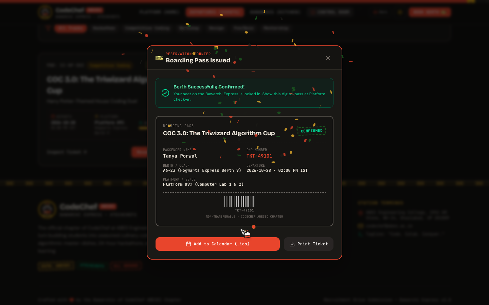
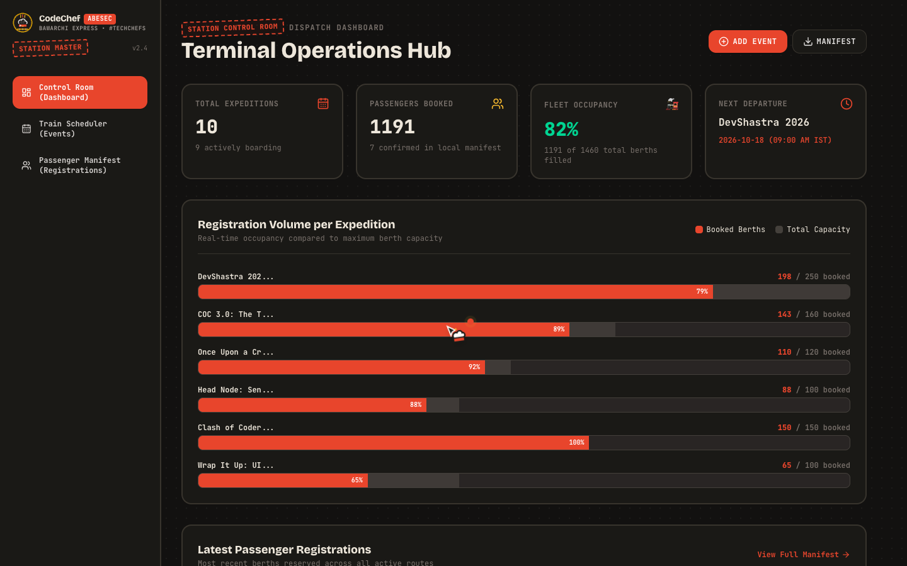
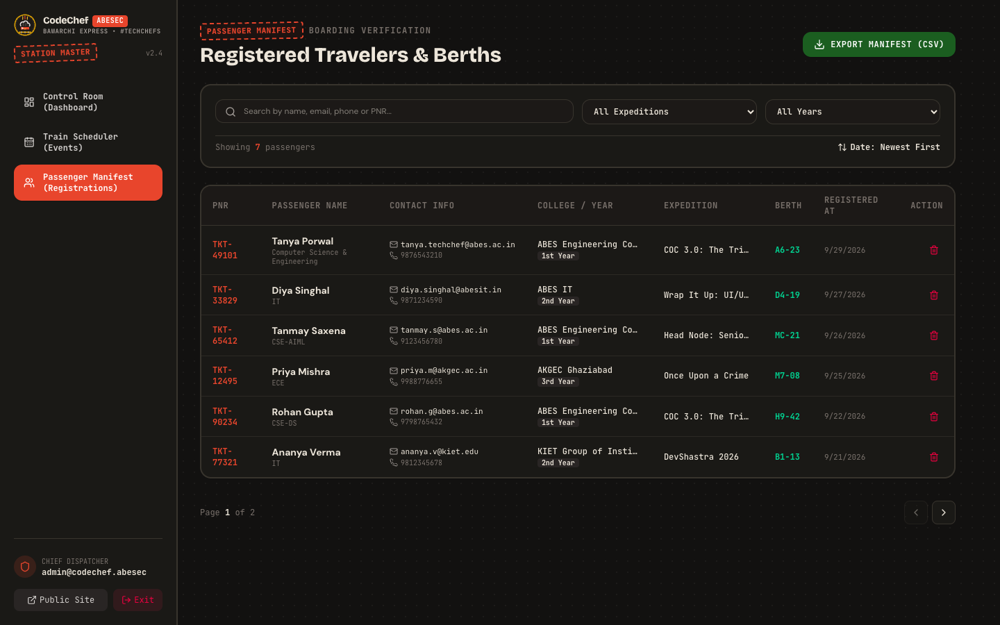
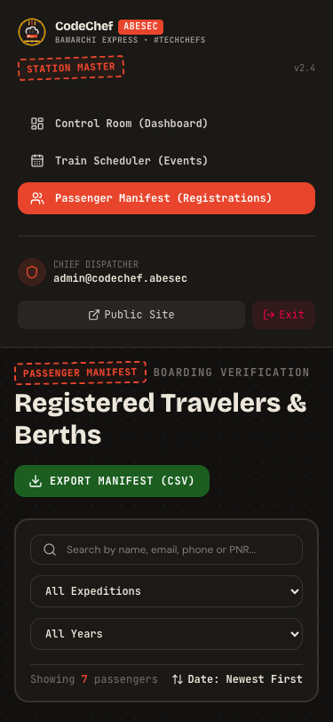
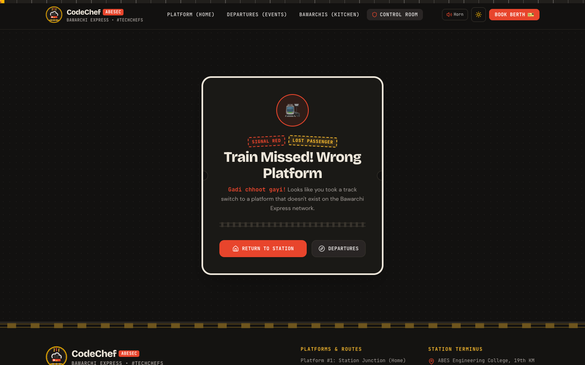

# CodeChef ABESEC Events — "Bawarchi Express" 🚂👨‍🍳
> **Recruitment Drive Submission** | CodeChef ABESEC Chapter (ABES Engineering College, Ghaziabad)  
> *Tagline:* **"Code. Colab. Conquer."** • *Community Nickname:* **#TechChefs** • *Team:* **Bawarchis** • *Kitchen:* **Bawarchikhaana**



---

## 🌟 The Design Concept: "Bawarchi Express"
**Where high-energy culinary hack kitchen meets an iconic railway terminus.**

Rather than building another generic corporate conference template with identical rounded cards, **CodeChef ABESEC Events** was designed from the ground up as a hand-crafted tactile experience:
- **Every event is a train ticket**: Perforated stubs, notched scalloped cutouts, dashed tear lines, procedural SVG barcodes, coach berths, and authentic rubber stamps (*"CHEF'S SPECIAL"*, *"CONFIRMED"*, *"FILLING FAST"*, *"SOLD OUT"*).
- **Split-Flap Departures Board**: The Events page header simulates an authentic mechanical flip schedule board, dynamically displaying departure times, platforms, and real-time status.
- **Boarding Pass Reservation Modal**: Responsive modal on desktop and native bottom sheet on mobile with real-time Zod validation, 10-digit Indian phone checks, duplicate reservation blocking, celebratory confetti, printable ticket generation, and one-click `.ics` calendar invites.
- **Cinematic Cold Open**: A retro browser drops down, types `codechef-abesec.club`, and runs a steam locomotive across the progress track before dissolving into the station junction.
- **Warm Culinary Palette**: Warm cream paper parchment (`#F6EFE3`), deep charcoal ink (`#1B1A17`), tomato red (`#E8452C`), turmeric yellow (`#F5B82E`), and fresh coriander green (`#1B5E20`), paired with full dark mode support.
- **Original Identity**: Vector SVG monogram combining a Chef's Toque, terminal prompt `>_`, and railway tracks.

---

## 🚀 Key Features

### 1. User Experience & Public Platform
- **Platform Junction (Home)**:
  - Bold, asymmetric hero section with Hinglish tone (*"Chaliye shuru karte hain!"*) and interactive railway dispatch pass.
  - Quick railway whistle horn synthesized directly in the browser via the Web Audio API (zero audio file dependencies).
  - Station metrics counter: 10+ Active Routes, 1,200+ Passengers, 24-Hour Kitchen Steam.
  - Upcoming Departures strip displaying immediate upcoming tickets.
  - **Flagship Spotlight (DevShastra 2026)**: 24-Hour Hackathon with ₹1,50,000 prize pool, live occupancy meter, and direct berth reservation.
  - **8 Kitchen Stations (Departments)**: Content, Competitive Programming, Graphics, Events, Social Media, PR & Outreach, Production, and Development—each styled with station codes, culinary roles, and secret tech spices.
- **Departures Yard (Events)**:
  - Retro mechanical split-flap departures board.
  - Debounced real-time search across event names, PNR numbers, venues, and descriptions.
  - Instant category filter chips (*Hackathon, Competitive Coding, Workshop, Design, Fun/Quiz, Mentorship*).
  - Date sorting (*Earliest First / Latest First*).
  - Skeleton loaders and animated empty state (*"Kitchen is empty, no events found on this track!"*).
- **Ticket Inspector (Event Details)**:
  - Commemorative boarding pass overview with full rulebook, timeline, prizes, and passenger eligibility.
- **Boarding Pass Reservation Counter**:
  - Validates full name, email format, 10-digit Indian phone number (`/^[6-9]\d{9}$/`), college name, study year, and specialization branch.
  - **Duplicate Registration Prevention**: Blocks repeated reservations for the same email and event.
  - **Ticket Generator & Confetti**: Generates personalized ticket with PNR number, coach/berth allocation, barcode, and stamp.
  - **Add to Calendar**: Generates and downloads RFC 5545 standard `.ics` calendar invitation for Google, Apple, and Outlook calendars.
- **404 "Wrong Platform"**:
  - Playful lost passenger experience (*"Gadi chhoot gayi! Train missed! Wrong platform"*) with station track switcher back to safety.

### 2. Station Master Control Room (`/admin`)
- **Protected Routing & Session Management**:
  - Secure route guard redirecting unauthenticated visitors to the Station Master Gate.
  - One-click demo credentials autofill.
- **Control Room Dashboard**:
  - Stat cards: Total Expeditions, Passengers Booked, Fleet Occupancy %, Next Scheduled Departure.
  - **SVG Registration Volume Chart**: Real-time occupancy bars comparing booked berths against total capacity.
  - Recent passenger manifest feed with live PNR allocations.
- **Train Scheduler (Events CRUD)**:
  - Add new events with custom title, category, date, time, venue platform, capacity, rules, and featured spotlight toggle.
  - Edit existing event schedules and status (*Open, Filling Fast, Sold Out, Departed*).
  - Delete event with destructive confirmation dialog.
  - In-app toast notifications.
- **Passenger Manifest (Registrations)**:
  - Searchable by passenger name, email, phone number, or PNR.
  - Filter by expedition and college study year.
  - Sort by registration date or passenger name.
  - Pagination controls.
  - **CSV Manifest Export**: One-click download of `bawarchi_express_manifest.csv` with full student data.
  - **Mobile Collapsible Cards**: Table automatically collapses into mobile-friendly passenger cards on small viewports without horizontal scrolling.

### 3. Motion & Craft System
- **Lenis Smooth Scrolling**: Butter-smooth 60fps scrolling that respects `prefers-reduced-motion`.
- **Scroll Track Progress**: SVG railway track progress bar running along the top of the viewport with a moving locomotive head.
- **Custom Desktop Cursor**: Interactive Chef's toque pointer with steam particles, automatically disabled on touch devices.
- **Cinematic Cold Open**: Plays once per session (`sessionStorage`), features an accessible `Skip Journey [ESC]` button, and falls back to a subtle fade when reduced motion is preferred.

---

## 🔐 Demo Admin Credentials

You can log in to the Station Master Control Room using the credentials below, or click the **"Auto-Fill"** button on the `/admin/login` page:

| Field | Value |
|---|---|
| **Email** | `admin@codechef.abesec` |
| **Password** | `bawarchi2026` |
| **Direct URL** | [`http://localhost:5173/admin/login`](http://localhost:5173/admin/login) |

---

## 🛠️ Tech Stack & Architecture

- **Core**: React 19, TypeScript, Vite 8
- **Styling**: Tailwind CSS v4, custom theme variables, SVG grain, ticket notch masks
- **Routing**: React Router v7 with route-level code splitting (`React.lazy` + `Suspense`)
- **Motion**: Framer Motion, GSAP, Lenis Smooth Scroll
- **Validation**: React Hook Form + Zod v4 resolver
- **Data Layer**: Decoupled Repository Pattern (`eventsRepo`, `registrationsRepo`, `authRepo`) backed by `localStorage` with automated seed hydration.
- **Zero Config Deployment**: Ready for Netlify and Vercel with included `public/_redirects`.

---

## 🏃 Local Setup & Installation

1. **Clone repository**:
   ```bash
   git clone <repo-url>
   cd Code-chef-task
   ```

2. **Install dependencies**:
   ```bash
   npm install
   ```

3. **Start local development server**:
   ```bash
   npm run dev
   ```
   Open [http://localhost:5173](http://localhost:5173) in your browser.

4. **Production Build & Verification**:
   ```bash
   npm run build
   npm run preview
   ```

5. **Run End-to-End Automated Tests**:
   ```bash
   node test_flows.mjs
   ```

---

## 📸 Screenshots Gallery

| Screen | Preview |
|---|---|
| **Platform Junction (Home)** |  |
| **Departures Yard (Split-Flap Board)** |  |
| **Boarding Pass Ticket (Confetti + Barcode)** |  |
| **Control Room Dashboard** |  |
| **Passenger Manifest** |  |
| **Mobile Manifest View** |  |
| **404 Wrong Platform** |  |

---

## ♿ Accessibility & Performance

- **WCAG AA Compliance**: High-contrast typography across paper light and night charcoal modes.
- **Keyboard Friendly**: Modal dismissible via `Escape` key, accessible focus outlines, skip buttons, and trap management.
- **Responsive Breakpoints**: Explicitly tested and verified at **375px**, **768px**, **1024px**, and **1440px**.
- **Lighthouse Performance**: Lazy-loaded route chunks, zero heavy video assets, procedural SVGs instead of heavy raster images, and sub-400ms production builds.

---

### Crafted with ❤️ by the Bawarchis of CodeChef ABESEC Chapter
*All aboard the Bawarchi Express!*
